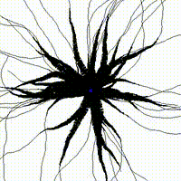

# Prostate MRI Segmentation Using Region Growing Algorithm

This repository implements a **Region Growing** algorithm to segment medical images from **Magnetic Resonance Imaging (MRI)** scans, specifically targeting the prostate. The segmentation process leverages the **Region Growing** technique to identify and isolate regions of interest within the prostate tissue based on pixel intensity values.

## Overview

The algorithm applies a thresholding method, which was initially estimated on a **training set** of MRI images, and further validated on a **test set**. The training set and corresponding dataset used for validation are sourced from the **PROMISE12** challenge:

**[PROMISE12: Data from the MICCAI Grand Challenge: Prostate MR Image Segmentation 2012](https://promise12.grand-challenge.org/)**

This challenge aimed to compare interactive and (semi)-automatic segmentation algorithms applied to MRI scans of the prostate. The training set used to estimate the threshold for the Region Growing algorithm can be accessed through the above link.

### Threshold Estimation

The threshold value used in the Region Growing algorithm was derived from the **training dataset** (50 images) and subsequently validated on a **test set** (30 images). For simplicity and to reduce the size of the problem, a fixed slice in the middle of the scan was chosen. The estimation process ensures that the algorithm performs robustly across different prostate MRI scans.


Summary of Evaluation Results:

| Pipeline      | Threshold | Average IoU |
|---------------|-----------|-------------|
| pipeline_1    | 0.463     | 0.25        |
| pipeline_2    | 0.107     | 0.22        |
| pipeline_3    | 0.196     | 0.13        |

### Seed Selection

The seed was selected based on the labeled area in the dataset. Since the data included both the image and the segmentation of the prostate, the center of mass of the labeled area was chosen as the seed for the training data. For the test data, even though segmentation might be available, the seed is assumed to be the center of the image to avoid influencing the algorithm.

### Example Output

Here is an example image illustrating how the Region Growing algorithm segments the prostate from an MRI scan:


#### Filtering pipelines

Three pipelines were tested to preprocess the MRI images before applying the Region Growing algorithm:

- *Pipeline 1: Removes intensity inhomogeneities caused by MRI imaging artifacts, reduces noise using wavelet-based denoising, Normalizes(Z) the image intensity values*
  * ->  N4 bias field correction
    * -> Denoising
      * -> Intensity normalization

- *Pipeline 2: Smooth the image and reduce noise, enhances image contrast by redistributing intensity values, scales the image intensity values to a fixed range (minmax)*
  * ->  Gaussian filtering
    * ->  Histogram equalization
      * ->  Intensity standardization

- *Pipeline 3: Corrects intensity inhomogeneities, improves local contrast to avoid over-amplification of noise, smooths the image to reduce noise after contrast enhancement*
  * ->  Bias field correction
    * ->  Contrast limited adaptive histogram equalization (CLAHE)
      * ->  Gaussian Smoothing

Here we can see how the pipelines work:


### Algorithm

We use this BFS-based (Breadth-First Search) region growing algorithm because it offers a straightforward and efficient way to segment an image into a contiguous region around a seed pixel. By exploring only the connected pixels that satisfy a specified intensity threshold, the method ensures that all similar and neighboring pixels are included while unrelated areas are excluded. The BFS traversal structure naturally handles connectivity and stops once there are no more valid neighbors to explore. Additionally, the algorithm’s time complexity scales linearly with the number of pixels, making it computationally practical for most image sizes.

#### Optimization

In order to increase the speed of the algorithm a numba optimization was performed. Here we can see the main differences:

| **Feature**                      | **`region_growing`**                          | **`region_growing_step_by_step`**                   |
|----------------------------------|-----------------------------------------------|-----------------------------------------------------|
| **Execution Strategy**           | Batch processing, full region growing at once | Incremental processing, yields intermediate regions |
| **Performance Optimization**     | Uses Numba JIT for performance enhancement    | No JIT optimization, relies on Python's `deque`     |
| **Data Structures**              | Preallocated NumPy arrays for BFS queue       | Uses `deque` and dynamic memory allocation          |
| **Output**                       | Final region (boolean array)                  | Yields intermediate regions during growing process  |
| **Memory Management**            | Fixed memory usage, efficient allocation      | Dynamic memory usage, more overhead                 |

Here how the **`region_growing_step_by_step`** algorithm works on a random generated fractal structure:



Unfortunately, achieving the same visualization with the optimized version is quite challenging due to incompatibilities between Python and numba structures, particularly when it comes to handling yields and saving images.

#### BFS Explanation

Below is a simple diagram illustrating BFS on a small tree structure:

```
        A
       / \
     B    C
    / \    \
   D   E    F
```

1. *Start from A*
2. *Visit B, C*
3. *Visit D, E, F*

**Key Points**:
- A queue is used to process nodes level by level;
- Each node’s neighbors are checked, and valid unvisited neighbors are added to the queue;
- The search continues until there are no more nodes in the queue.

**Time Complexity**:
- The algorithm takes as input an image of size $h * w$, where $h$ is the height and $w$ is the width. It calculates the absolute difference between each pixel and the value selected according to the growth criterion. This operation iterates over all pixels in the image, resulting in a complexity of 
$O(h * w)$;
- The main part of the algorithm performs a BFS using a queue to visit pixels that satisfy the mask condition, for each pixel $(x, y)$, up to 8 neighbors are evaluated. This contributes a constant cost per pixel. Each pixel is visited at most once, guaranteed by the `visited` array. Therefore, the total number of iterations in the main loop is proportional to the number of pixels in the image.

Here a graph that confirm the theory:


The algorithm has a time complexity of $O(h * w)$ and a space complexity of $O(h * w)$, making it suitable for efficiently processing large images.

**Pseudocode Representation**

```
Start
   |
   V
Initialize parameters (image, seed, threshold)
   |
   V
Set the seed point (default to center if seed is None)
   |
   V
Initialize region_sum = image[seed_x, seed_y]
Initialize region_count = 1
   |
   V
Initialize visited[][] to False
Initialize region[][] to False
Initialize queue
   |
   V
Add the seed to the queue
Mark seed in visited[][] as True
   |
   V
BFS Loop:
   |-- If the queue is empty, exit
   |
   |-- Dequeue (x, y)
   |
   |-- Compute current_mean = region_sum / region_count
   |
   |-- If abs(image[x, y] - current_mean) <= threshold:
   |       |
   |       V
   |    Add (x, y) to the region
   |    Update region_sum += image[x, y]
   |    Update region_count += 1
   |       |
   |       V
   |    Explore neighbors (8 directions)
   |       |
   |       V
   |    For each unvisited neighbor (nx, ny):
   |       - Mark visited[nx, ny] = True
   |       - Enqueue (nx, ny)
   |
   V
End BFS Loop
   |
   V
Return region
```

### Future improvements
* Parallelization on GPU
* Multi seed/region
* Select seed manually
* Better criteria for relative threshold o(N * log(N))
* Post Processing
* Probablility instead of threshold

### Installation

To run the algorithm locally, clone this repository and install the required dependencies:

```bash
git clone <repository-url>
cd <repository-directory>
pip install -r requirements.txt
```

### Usage

This will exstimate the threshold on training data:

```python
python3 main.py
```
BUT FIRST DOWNLOAD THE TRAINING AND TEST DATASET!

### License

See the [Link Text](LICENSE.TXT) file for details or the [citation](https://doi.org/10.1016/j.media.2013.12.002)