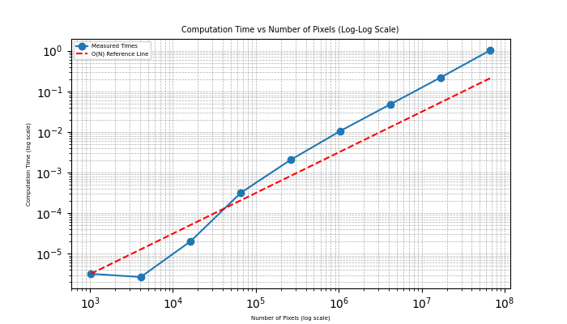
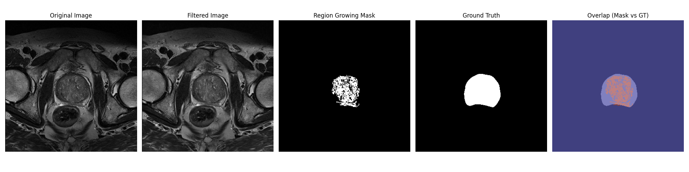

# Prostate MRI Segmentation Using Region Growing Algorithm

This repository implements a **Region Growing** algorithm to segment medical images from **Magnetic Resonance Imaging (MRI)** scans, specifically targeting the prostate. The segmentation process leverages the **Region Growing** technique to identify and isolate regions of interest within the prostate tissue based on pixel intensity values.

## Overview

The algorithm applies a thresholding method, which was initially estimated on a **training set** of MRI images, and further validated on a **test set**. The training set and corresponding dataset used for validation are sourced from the **PROMISE12** challenge:

**[PROMISE12: Data from the MICCAI Grand Challenge: Prostate MR Image Segmentation 2012](https://promise12.grand-challenge.org/)**

This challenge aimed to compare interactive and (semi)-automatic segmentation algorithms applied to MRI scans of the prostate. The training set used to estimate the threshold for the Region Growing algorithm can be accessed through the above link.

### Threshold Estimation

The threshold value used in the Region Growing algorithm was derived from the **training dataset** and subsequently validated on a **test set**. The estimation process ensures that the algorithm performs robustly across different prostate MRI scans.

Summary of Evaluation Results:

* Pipeline: pipeline_1
  * Threshold: 0.486 &nbsp;&nbsp;&nbsp;&nbsp;&nbsp;&nbsp; Average IoU: 0.2228

* Pipeline: pipeline_2
  * Threshold: 0.100 &nbsp;&nbsp;&nbsp;&nbsp;&nbsp;&nbsp; Average IoU: 0.1886

* Pipeline: pipeline_3
  * Threshold: 0.175 &nbsp;&nbsp;&nbsp;&nbsp;&nbsp;&nbsp; Average IoU: 0.1171

### Pipelines

Three pipelines were tested to preprocess the MRI images before applying the Region Growing algorithm:

* Pipeline 1
  * ->  N4 bias field correction
    * -> Denoising
      * -> Intensity normalization

Removes intensity inhomogeneities caused by MRI imaging artifacts, reduces noise using wavelet-based denoising, Normalizes(Z) the image intensity values

* Pipeline 2
  * ->  Gaussian filtering
    * ->  Histogram equalization
      * ->  Intensity standardization

Smooth the image and reduce noise, enhances image contrast by redistributing intensity values, scales the image intensity values to a fixed range (minmax)

* Pipeline 3
  * ->  Bias field correction
    * ->  Contrast limited adaptive histogram equalization (CLAHE)
      * ->  Gaussian Smoothing

Corrects intensity inhomogeneities, improves local contrast to avoid over-amplification of noise, smooths the image to reduce noise after contrast enhancement

Here we can see how the pipelines work:


### Algorithm

We use this BFS-based (Breadth-First Search) region growing algorithm because it offers a straightforward and efficient way to segment an image into a contiguous region around a seed pixel. By exploring only the connected pixels that satisfy a specified intensity threshold, the method ensures that all similar and neighboring pixels are included while unrelated areas are excluded. The BFS traversal structure naturally handles connectivity and stops once there are no more valid neighbors to explore. Additionally, the algorithm’s time complexity scales linearly with the number of pixels, making it computationally practical for most image sizes.

Here how the algorithm works on a random generated fractal structure:


### BFS Explanation

Below is a simple diagram illustrating BFS on a small tree structure:

```
        A
       / \
     B    C
    / \    \
   D   E    F
```

1. Start from A
2. Visit B, C
3. Visit D, E, F

**Key Points**:
- A queue is used to process nodes level by level.
- Each node’s neighbors are checked, and valid unvisited neighbors are added to the queue.
- The search continues until there are no more nodes in the queue.

**Time Complexity**:
- In general graph terms, the complexity is \(O(|V| + |E|)\).
- For image-based region growing, where \(|V|\) is the number of pixels and \(|E|\) is bounded by the pixel connections, this becomes linear in the total number of pixels (often expressed as \(O(N)\) for an N-pixel image).

Here a graph that confirm the theory:



### Pseudocode Representation

Here we can a scheme of the algorithm:

```
Start
   |
   V
Initialize parameters (image, seed, threshold)
   |
   V
Set the seed point
   |
   V
Compute the threshold mask
   |
   V
Initialize visited, region, and queue
   |
   V
Add the seed to the queue and mark it as visited
   |
   V
BFS Loop:
   |-- If the queue is empty, exit
   |
   |-- Dequeue (x, y)
   |
   |-- If mask[x, y] is true:
   |     |
   |     V
   |  Add (x, y) to the region
   |     |
   |     V
   |  Explore neighbors (8 directions)
   |     |
   |     V
   |  For each unvisited neighbor:
   |     - Mark as visited
   |     - Add to the queue
   |
   V
End Loop
   |
   V
Return the region
```

### Example Output

Here is an example image illustrating how the Region Growing algorithm segments the prostate from an MRI scan:



### Future improvement
* Parallelization on GPU
* Multi seed/region
* Select seed manually
* Relative threshold
* Post Processing
* Probablility instead of threshold

## Installation

To run the algorithm locally, clone this repository and install the required dependencies.

```bash
git clone <repository-url>
cd <repository-directory>
pip install -r requirements.txt
```

## Usage

This will exstimate the threshold on training data

```python
python3 main.py
```
BUT FIRST DOWNLOAD THE TRAINING AND TEST DATASET!
## License

See the [Link Text](LICENSE.TXT) file for details.